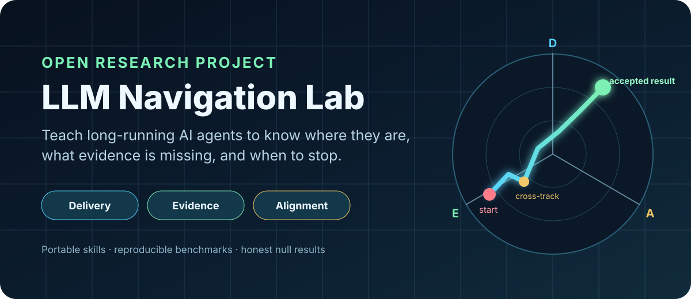

<div align="center">



# LLM Navigation Lab

**Portable navigation skills that help long-running AI agents distinguish real progress from activity, preserve constraints, keep evidence fresh, and stop at the accepted result.**

[](LICENSE)
[](docs/research-overview.md)
[](skills/)
[](experiments/README.md)

[▶ Launch the live simulator](https://alexandrkotelnikov.github.io/llm-navigation-lab/) · [Install Atlas](install/) · [Try it in 2 minutes](docs/quickstart.md) · [Read the evidence](experiments/README.md) · [Русская версия](README.ru.md)

</div>

---

## The problem

Long-running agents can edit dozens of files, research new frameworks, refactor architecture, and still fail to get closer to what the user will actually accept.

A task list tells you that **work happened**. It does not reliably tell you:

- whether a required result improved;
- whether its proof is still fresh after later changes;
- whether user constraints were preserved;
- whether the agent is moving forward, sideways, backward, or in circles;
- whether it should stop.

**LLM Navigation Lab treats agent work as navigation toward an accepted outcome.**

## Try the interactive simulator

The browser-based Project Atlas simulator turns the navigation model into a concrete decision game. Choose a maneuver and watch the coordinates, obligations, route geometry, movement class, and landing gates change.

**[Launch the live simulator →](https://alexandrkotelnikov.github.io/llm-navigation-lab/)**

Included scenarios:

1. **Evidence deficit** — the product exists, but verification is missing or stale.
2. **Alignment breach** — functionality improved by violating a hard constraint.
3. **Orbit trap** — repeated optional work does not close required obligations.
4. **Route choice** — two compliant repairs create different Evidence damage.

The demo is a static, zero-dependency application. It can also be opened locally from [`demo/index.html`](demo/index.html), with no server or build step.

## Two navigation skills

| Skill | Model | Best for | Core question |
|---|---|---|---|
| **[Astrolabe v0.3](skills/astrolabe/)** | Required obligations + evidence debt | Research-heavy or artifact-heavy work with drift risk | Did the last action improve a required outcome or its proof? |
| **[Project Atlas v0.1.1](skills/project-atlas/)** | `Delivery × Evidence × Alignment` coordinates | Long-running agent work with tests, constraints, and handoffs | Where is the project now, what is the bearing, and how direct is the route? |

Both are text-only, portable, version-controlled, independent of an external server or database, and designed to preserve observable evidence rather than private reasoning.

## Install Project Atlas

Choose a repository-local integration:

| Harness | Guide |
|---|---|
| Codex app, CLI, or IDE extension | [Install for Codex](install/codex/README.md) |
| Claude Code | [Install for Claude Code](install/claude-code/README.md) |
| Cursor | [Install for Cursor](install/cursor/README.md) |
| Gemini CLI | [Install for Gemini CLI](install/gemini-cli/README.md) |
| Any file-aware agent | [Generic integration](install/generic/README.md) |

Every guide points to the same [shared smoke test](install/smoke-test.md), so installation is judged by visible behavior rather than by whether files were merely copied.

**[Open the installation index →](install/)**

## Try Project Atlas in 2 minutes

Copy:

```text
skills/project-atlas/SKILL.md
skills/project-atlas/STATE_TEMPLATE.md
```

Then tell your agent:

```text
Use Project Atlas from skills/project-atlas/SKILL.md.
Maintain ATLAS_STATE.md with Delivery, Evidence, Alignment,
movement class, evidence freshness, route metrics, and the next bounded maneuver.
Do not declare completion until every landing gate passes.
```

Use it on a task with multiple deliverables, explicit constraints, and verification.

**[Open the complete two-minute walkthrough →](docs/quickstart.md)**

## What Atlas observes

```text
P = (Delivery, Evidence, Alignment)
G = (1.00, 1.00, 1.00)
```

- **Delivery** — the required output exists and satisfies the contract.
- **Evidence** — acceptance checks are current and tied to the latest relevant changes.
- **Alignment** — user intent, scope boundaries, and forbidden approaches remain intact.

| Movement | Meaning |
|---|---|
| `APPROACH` | weighted distance to acceptance decreased |
| `EVIDENCE` | the maneuver followed the dominant Evidence bearing |
| `ALIGNMENT_RECOVERY` | a violated user constraint or forbidden approach was repaired |
| `CROSS_TRACK` | activity occurred without material progress on the current bearing |
| `RETREAT` | weighted acceptance distance increased |
| `LANDING` | every mandatory coordinate and obligation passes |

Atlas also tracks path length, net progress, orbit ratio, stale evidence, hazards, and landing blockers.

## Evidence, not marketing claims

This repository preserves positive results, parity, evaluator defects, and null findings.

| Experiment finding | Result |
|---|---|
| Complex proxy-progress recovery | Astrolabe showed a replicated local recovery-latency advantage |
| Matched-state recovery | Strong Planner and Astrolabe were functionally tied |
| Evidence-deficit coordinate pilot | Atlas used 4 rather than 5 steps and avoided one cross-track step in both repetitions |
| Straightforward Alignment repair | All three methods tied |
| Explicit route-choice pilot | All three methods selected the lower-damage route |
| Micro-recovery pilot | Formally rejected as `MEASUREMENT_INVALID` after evaluator defects were found |

**No universal superiority claim is supported yet.** The project improves through falsifiable tests rather than selective demos.

[Read all experiment reports →](experiments/README.md)

## When to use these skills

Use a navigation skill when several of these are true:

- the task has multiple required deliverables;
- acceptance depends on tests, inspection, evidence, or review;
- there are explicit constraints or forbidden approaches;
- the work spans many agent cycles or handoffs;
- optional research or refactoring can look productive;
- later changes can invalidate earlier proof;
- false completion would be expensive.

Do not use them for trivial edits, short answers, or a single immediately observable deliverable.

## Repository map

```text
skills/                  portable Astrolabe and Project Atlas skills
demo/                    zero-dependency interactive simulator
install/                 harness-specific installation guides and smoke test
experiments/reports/     complete experimental reports
docs/                    methodology, quickstart, and research framing
launch/                  release notes, publication drafts, and launch checklist
assets/                  hero and social-preview artwork
tools/                   repository validation
tests/                   structural and invariant tests
```

## What makes this different

Many agent frameworks focus on planning, orchestration, memory, or tool use. This project focuses on a narrower question:

> **How can an agent observe whether its latest action moved the project toward the result the user will accept?**

Distinct mechanisms include frozen obligation registries, evidence invalidation, non-compensable Alignment, cross-track and orbit detection, stale-handoff revalidation, correction through the smallest open required action, and zero-write landing.

## Contribute a real failure case

The most valuable contributions are concrete situations where an agent completed the wrong thing, kept working after success, invalidated tests without rerunning them, improved Delivery while violating Alignment, researched endlessly, or followed a plan but lost the actual goal.

Open an issue using the experiment template and include the task, constraints, observable trajectory, and final verifier result.

## Launch and reproduce

- [Public launch kit](launch/)
- [v0.2.0 release notes](launch/release-notes-v0.2.0.md)
- [Independent reproduction request](https://github.com/AlexandrKotelnikov/llm-navigation-lab/issues/3)
- [Next hidden-consequence benchmark](https://github.com/AlexandrKotelnikov/llm-navigation-lab/issues/1)

## Validate locally

```bash
python3 tools/validate_repository.py
python3 -m unittest discover -s tests -v
```

The simulator itself requires no build step. Open `demo/index.html` directly in a browser.

## Status

Research prototype with an interactive simulator and repository-local installation packages. The next research milestone is a hidden-consequence route-choice benchmark in which agents must infer evidence damage without an explicit route hint.

See [ROADMAP.md](ROADMAP.md).

## Research stance

Null results, parity, evaluator failures, and limitations are intentionally preserved. The goal is to build credible navigation mechanisms for AI agents, not to manufacture a winning benchmark.

## License

MIT. See [LICENSE](LICENSE).
